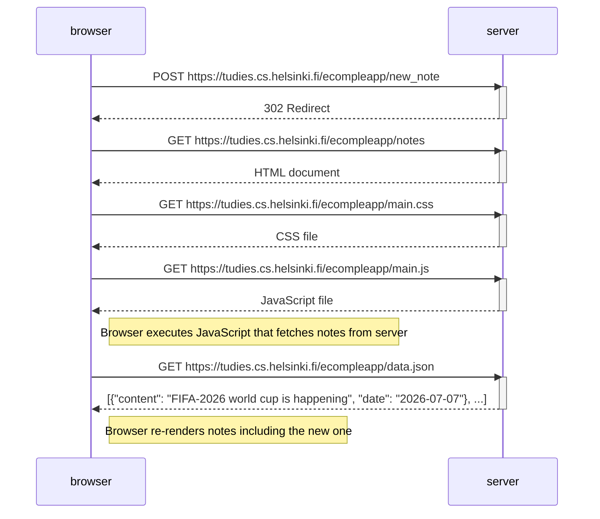

# Exercise 0.4: New Note Diagram

**Submiited By:** Muhammad Taha Nawab

```mermaid
sequenceDiagram
    participant browser
    participant server

    browser->>server: POST https://tudies.cs.helsinki.fi/ecompleapp/new_note
    activate server
    server-->>browser: 302 Redirect
    deactivate server

    browser->>server: GET https://tudies.cs.helsinki.fi/ecompleapp/notes
    activate server
    server-->>browser: HTML document
    deactivate server

    browser->>server: GET https://tudies.cs.helsinki.fi/ecompleapp/main.css
    activate server
    server-->>browser: CSS file
    deactivate server

    browser->>server: GET https://tudies.cs.helsinki.fi/ecompleapp/main.js
    activate server
    server-->>browser: JavaScript file
    deactivate server

    note right of browser: Browser executes JavaScript that fetches notes from server

    browser->>server: GET https://tudies.cs.helsinki.fi/ecompleapp/data.json
    activate server
    server-->>browser: [{"content": "FIFA-2026 world cup is happening", "date": "2026-07-07"}, ...]
    deactivate server

    note right of browser: Browser re-renders notes including the new one
```
